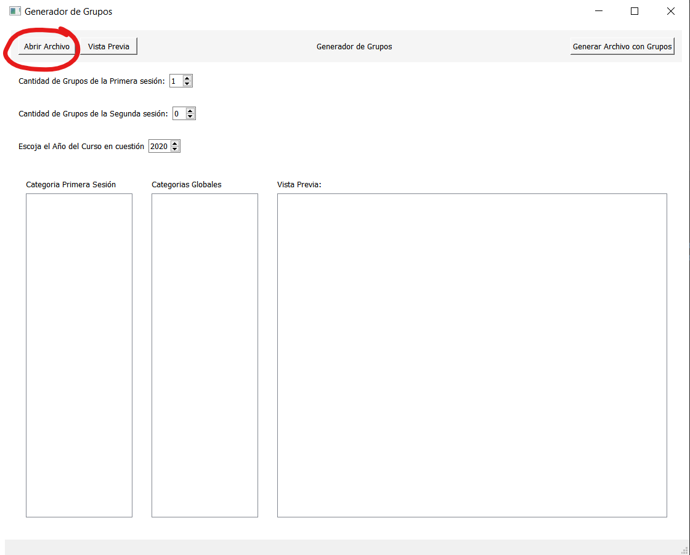
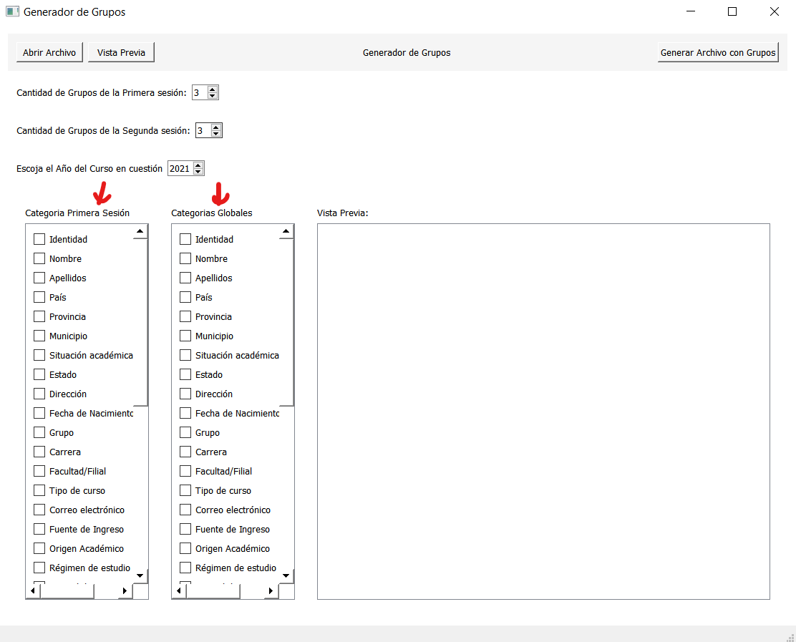
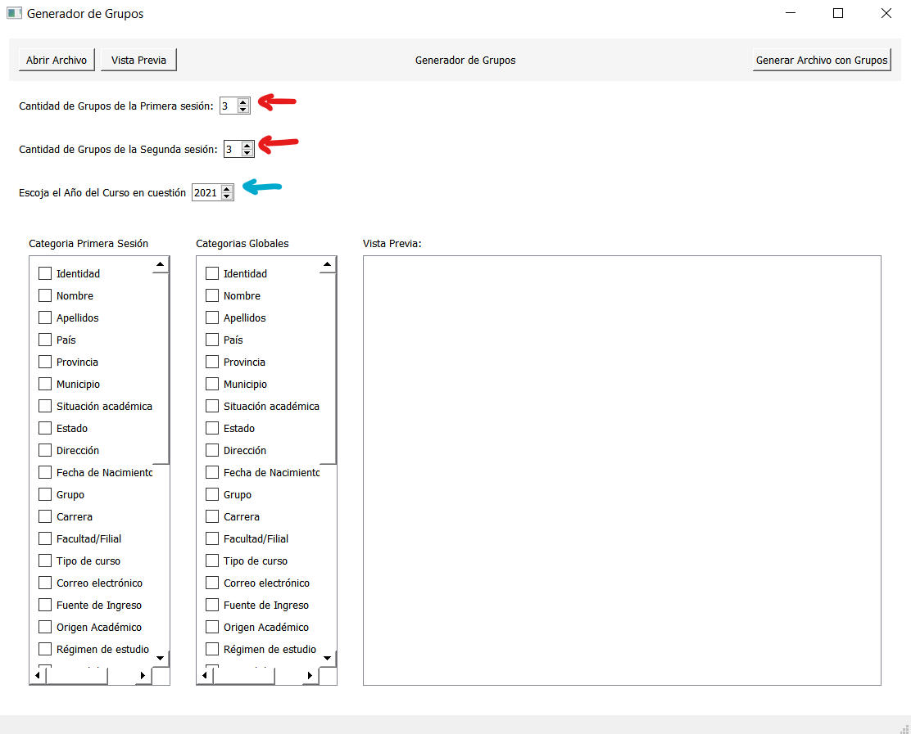
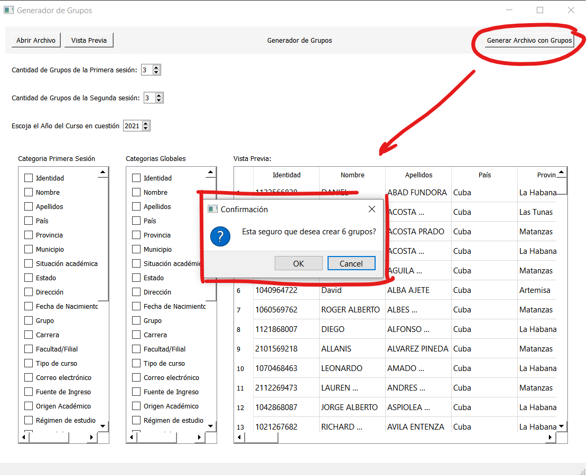
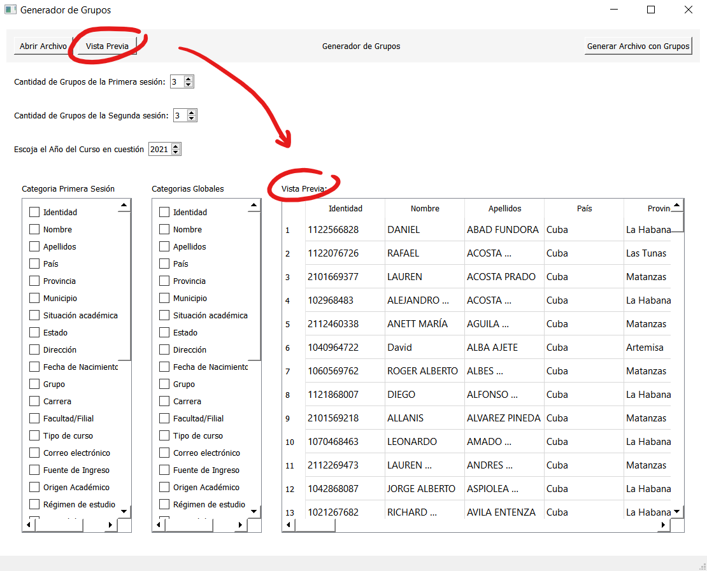

# Proyecto de Modelos de Optimización

## Integrantes

#### Laura Tamayo Blanco C411
#### Yasmin Cisneros Cimadevila C411
#### Jessy Gigato Izquirdo C411
#### Nelson Mendoza Alvarez C411

---

## Instalación
Para realizar la instalación de las bibliotecas necesarias para el proyecto ejecute la siguiente línea:

> pip install -r requeriments.txt

\
Si desea ejecutar el programa como un archivo de python:
> python '.\Generador de Grupos.py'     

\
Para generar el ejecutable .exe para utilizar la aplicación:

> pyinstaller --windowed --onefile '.\Generador de Grupos.py'

    Este proceso puede demorar algunos segundos ya que se generan una amplia cantidad de archivos

Luego el ejecutable se encontrará en la dirección `"dist/Generador de Grupos.exe"` y ya se encontrará listo para su uso.

---

## Sobre la aplicación:

Para su uso primeramente debe de agregar el archivo excel (.xlsx)  

Se desplegara el menú de categorias por las cuales se puede seleccionar para realizar una repartición de los grupos de forma homogénea tomando como referencia las mismas.

Recuerde seleccionar la cantidad de grupos y el año inicial del proceso de matriculado

Una vez se guarden los archivos, estos serán guardados en la carpetas `"Grupos"` y `"Matrícula"` que se generará automaticamente, una representara la distribucion de los grupos con toda su información y el otro guardara el listado de matrícula respectivamente.

### Dato Extra
Para chequear si el archivo que abrió es el correcto siempre puede previsualizarlo:

----
\
Para testear la aplicacion en el directorio: `"./data"` se encuentra un ejemplo de base de datos de estudiantes de nuevo ingreso.

-----

## Datos de Importancia:

El ejecutable presentará un peso importante y un poco de lentitud ya que en si mismo tuvo que intalar una amplia gama de bibliotecas para su uso. Consideramos dejarlo así ya su uso será una vez por curso y se priorizó que mantuviera una interfaz intuitiva.